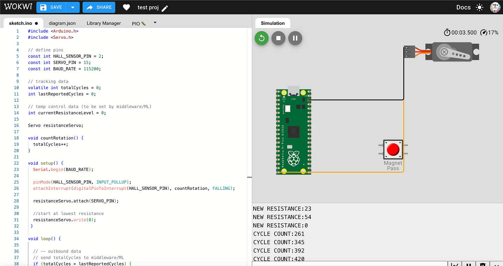

# Smart Bike Resistance Project

A side project to experiment with C++, its interactions with a machine learning model, and its relations with an Rasp Pi Pico microcontroller with the hope to make my bike smarter (resistance depending on my past Strava rides and map geography)!

## Hardware
- **Microcontroller:** Raspberry Pi Pico
- **Cadence Sensor:** Hall Effect Sensor (connected to GP2)
- **Resistance Actuator:** Servo Motor (connected to GP15)

## Pin Definitions
| Component | Pico Pin | Function |
| :--- | :--- | :--- |
| **Hall Sensor** | GP2 | Interrupt-driven pulse counting to track rotations. |
| **Servo Motor** | GP15 | Dynamic resistance control via PWM signals. |

## System Architecture

The firmware utilizes an **Asynchronous Logic** model to ensure the bike's "speedometer" and "resistance" are independent:

1. **Tracking (Hardware Interrupt):** The Hall sensor triggers a hardware interrupt on every rotation, incrementing a `totalCycles` counter immediately.
2. **Middleware Output:** The Pico sends raw data to the computer over Serial with the prefix `DATA:`.
3. **Dynamic Control (Inbound Serial):** The Pico listens for resistance updates from the middleware. Using `Serial.available()`, it receives target angles (0-180) and updates the servo position without pausing the rotation counter.

## How to Build

### Requirements
- **Language:** C++ (Arduino Framework)
- **IDE:** Wokwi or Arduino IDE
- **Libraries:** `Servo.h` (Standard Raspberry Pi Pico Servo library)
