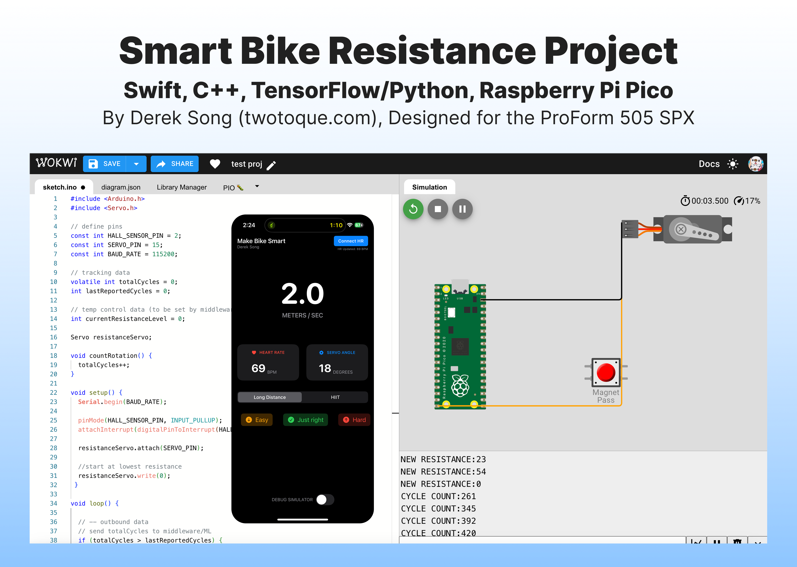
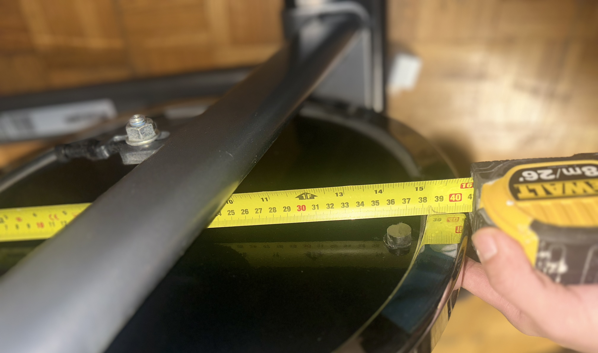
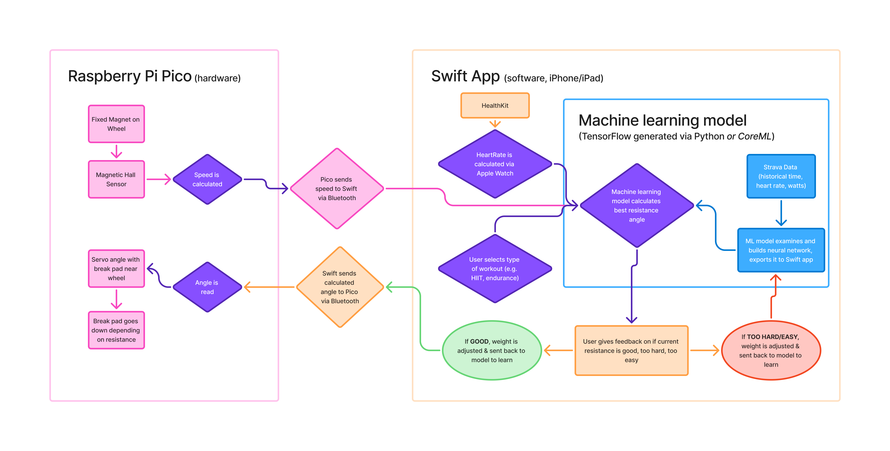
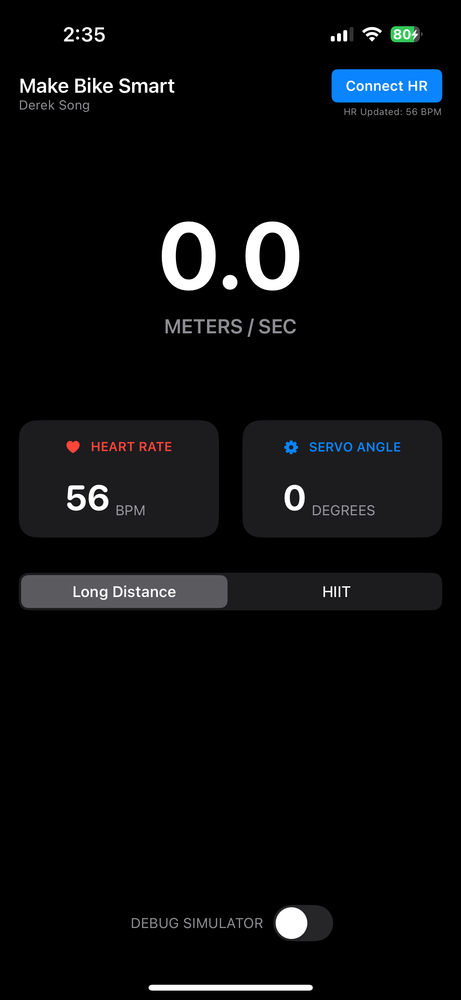

# Smart Bike Resistance Project

This project aims to make traditional stationary bikes smarter with dynamic resistance. The main objective of this project is to experiment with C++ and its interactions with a machine learning model on TensorFlow/Python with an active feedback loop. The goal is to connect these systems with a Raspberry Pi Pico microcontroller to make my bike smarter by adjusting resistance based on my past Strava rides.

## The Problem
Traditional stationary bikes like my ProForm 505 SPX rely on a manual tension knob that requires constant human intervention to adjust workout intensity. This creates a disconnected training experience where the resistance does not respond to actual fatigue levels, specific training goals like HIIT or endurance, or past Strava performance. 

This tool solves the problem by using an external motor to resist the flywheel. Although the bike provides some data, I inferred data from past activities to calculate distance via a magnetic Hall effect sensor that tracks every rotation of the 36.5 cm diameter flywheel. By combining this with a neural network trained on historical Strava performance, the system provides a fully automated and data driven cycling experience.

## Architecture 

A Swift app hosted on an iPad or iPhone connects to the Raspberry Pi Pico through Bluetooth. This app also connects to the HealthKit package to monitor heart rate. The Pico tracks speed through the magnetic hall sensor. This information is fed to a machine learning model to determine the appropriate angle of resistance which is then sent back to the Pico. 

### Tech Stack 

#### Software & Mobile Development
* Swift: The primary language for the project, used to build the user interface and manage the core logic on iOS and iPadOS.

  * HealthKit: A framework integrated into the Swift app to access real-time biometric data, specifically the user's heart rate, to inform the resistance model.

  * Bluetooth: The communication protocol used to bridge the gap between the mobile application and the Raspberry Pi Pico.

#### Machine Learning
* Python: Used for data engineering tasks, such as interfacing with the Strava API to fetch historical activity data and training the neural network.

* TensorFlow Lite: The model is converted and deployed as a lightweight file to perform on-device inference within the Swift app for real time resistance adjustments.

#### Embedded Systems & Hardware
* C++: powers the Raspberry Pi Pico via the Arduino framework to handle hardware interrupts and low level peripheral control.

* Raspberry Pi Pico: The central microcontroller that processes sensor data and physically controls the bike's mechanical resistance.

  * Hall Effect Sensor: A magnetic sensor used to track flywheel rotations, allowing the system to calculate speed and distance.

  * Servo Motor: The mechanical actuator that physically adjusts the bike's resistance based on the target angles calculated by the machine learning model.

## Software (Swift App)

A Swift powered app serves as the main user interface to control the machine. It currently displays live heart rate during active workout sessions. It also prompts the user to indicate if the resistance is good, too easy, or too hard. The app contains the machine learning model used to calculate the best input. 

## Machine Learning Model (beta)

The machine learning model acts as a personalized digital coach that translates effort into mechanical resistance on the wheel. The model analyzes old Strava ride data and running data to understand fitness profiles.

During a live ride, it takes four real time inputs: heart rate from HealthKit, current wheel speed from the magnetic hall effect sensor, time elapsed, and workout mode. The system adjusts based on whether the body is warming up, sprinting, or showing signs of fatigue. It also incorporates feedback on whether the resistance feels correct The model is stored in bike_prediction_model.tflite, while scripts to fetch Strava API data and build the model are in the /ml-model directory.

## Hardware

* **Microcontroller:** Raspberry Pi Pico 
* **Cadence Sensor:** Hall Effect Sensor connected to GP2 
* **Resistance Actuator:** Servo Motor connected to GP15

## Pin Definitions
| Component | Pico Pin | Function |
| :--- | :--- | :--- |
| **Hall Sensor** | GP2 | Interrupt driven pulse counting to track rotations. |
| **Servo Motor** | GP15 | Dynamic resistance control via PWM signals. |

## System Architecture

The firmware utilizes an asynchronous logic model to ensure the speed tracking and resistance control remain independent:

1. **Tracking:** The Hall sensor triggers a hardware interrupt on every rotation to increment a totalCycles counter immediately.
2. **Middleware Output:** The Pico sends raw data to the computer over Serial with the prefix DATA:.
3. **Dynamic Control:** The Pico listens for resistance updates from the middleware. It receives target angles between 0 and 180 and updates the servo position without pausing the rotation counter.

## How to Build Hardware

### Requirements
* **Language:** C++ using the Arduino Framework
* **IDE:** Wokwi or Arduino IDE 
* **Libraries:** Servo.h for the Raspberry Pi Pico 