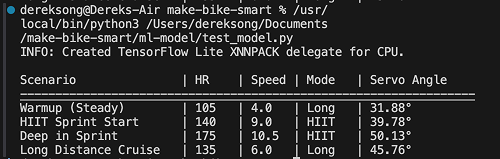

# Smart Bike Resistance Project

A side project to experiment with C++, its interactions with a machine learning model, and its relations with an Rasp Pi Pico microcontroller with the hope to make my bike smarter (resistance depending on my past Strava rides and map geography)!

## The Problem
Traditional stationary bikes, specifically models like my **ProForm 505 SPX**, rely on a manual tension knob that requires constant human intervention to adjust workout intensity. This creates a disconnected training experience where the resistance does not respond to the rider's actual fatigue levels, specific training goals such as HIIT or endurance, as well as past Strava rides. 

This tool aims to solve that by using an external motor to resist the flywheel. Despite the bike having data like wattage, we infered running data as well as past running data to get distance via a magnetic Hall effect sensor that tracks every rotation of the 36.5 cm diameter flywheel. By combining this data with a neural betwork trained on historical Strava erformance, the system eliminates the need for manual adjustments and provides a fully automated, data-driven cycling experience.

## Machine Learning Model (beta)

The machine learning model acts as a personalized digital coach that translates your  effort into mechanical resistance on the wheel. The model analyzes my old Strava ride data (heart rate only, that doesn't include watts) as well as running data (which includes both heart rate and watts).

During a live ride, it takes four real-time inputs: your heart rate (through healthkit?), current wheel speed (determined by a magnetic hall effect sensor, with a 38cm diameter wheel distance), time elapsed, and workout mode (0 = long distance, 1 = HIIT). This then processes them through a neural network that has "learned" your specific fitness profile. The system tightens or loosens based on whether your body is warming up, sprinting in HIIT mode, or showing signs of fatigue.

The model can be found on `bike_prediction_model.tflite` and functions to fetch data through the Strava API, build the model, and test the model can be found in the `/ml-model` page. 

## Hardware
- **Microcontroller:** Raspberry Pi Pico
- **Cadence Sensor:** Hall Effect Sensor (connected to GP2)
- **Resistance Actuator:** Servo Motor (connected to GP15)

## Pin Definitions
| Component | Pico Pin | Function |
| :--- | :--- | :--- |
| **Hall Sensor** | GP2 | Interrupt-driven pulse counting to track rotations. |
| **Servo Motor** | GP15 | Dynamic resistance control via PWM signals. |

## System Architecture

The firmware utilizes an **Asynchronous Logic** model to ensure the bike's "speedometer" and "resistance" are independent:

1. **Tracking (Hardware Interrupt):** The Hall sensor triggers a hardware interrupt on every rotation, incrementing a `totalCycles` counter immediately.
2. **Middleware Output:** The Pico sends raw data to the computer over Serial with the prefix `DATA:`.
3. **Dynamic Control (Inbound Serial):** The Pico listens for resistance updates from the middleware. Using `Serial.available()`, it receives target angles (0-180) and updates the servo position without pausing the rotation counter.

## How to Build

### Requirements
- **Language:** C++ (Arduino Framework)
- **IDE:** Wokwi or Arduino IDE
- **Libraries:** `Servo.h` (Standard Raspberry Pi Pico Servo library)
